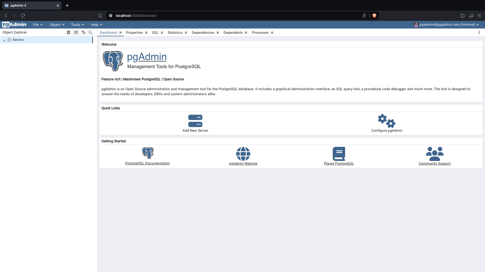

# 🛎️ ChoreSync: Roommate Task Coordinator


## 📖 Table of Contents

- [📝 Contributors](#📝-contributors)
- [📜 Description](#📜-description)
- [📚 Tech Stack](#📚-tech-stack)
- [🧩 Architecture Overview](#🧩-architecture-overview)
- [📱 Frontend Documentation](#📱-frontend-documentation)
- [🚀 Backend Documentation](#🚀-backend-documentation)
  - [Database Setup](#database-setup)
  - [Running the Backend](#running-the-backend)

## 📝 Contributors

- Mariia Podgaietska
- Jayden Mikulcik
- Ryan Lau
- Axel Sanchez
- Evan Cherewko
- Alex On
- Rhishik Roy

## 📜 Description

Roommate task board application. Many roommates living together can add and remove tasks to a shared board. This will help organize chores and tasks within a shared space and increase the quality of life within shared living situations.

## 📚 Tech Stack

- Frontend


- Backend


- Database


- DevOps


## 🧩 Architecture Overview


## 📱 Frontend Documentation

Coming soon...

## 🚀 Backend Documentation

### Database Setup

1. Open the terminal and clone this repository using HTTPS or SSH (The example below uses SSH).

```bash
git clone git@github.com:2BlackCats/ENSF401_Final_Project.git
```

2. `cd` into the `ENSF401_Final_Project` directory.

```bash
cd ENSF401_Final_Project
```

3. `cd` into the `backend` directory.

```bash
cd backend
```

4. Run the following command to start the PostgreSQL database using Docker.

```bash
docker-compose up postgres pgadmin4 -d
```

5. Open a web browser and navigate to `http://localhost:5050`. Log in to the pgAdmin4 web interface using the following credentials:

- Email: `pgadmin4@pgadmin.com`

- Password: `admin`


6. Right-click on `Add New Server` in the `Quick Links` section.



7. Enter the following details in the `General` tab:

- Name: `ChoreSync`


8. Click on the `Connection` tab and enter the following details:

- Host name/address: `postgres`

- Port: `5432`

- Username: `postgres`

- Password: `root`

- Save password?: `Yes`


9. Click on the `Save` button to save the server configuration.

10. Right-click on the `ChoreSync` server and select `Create > Database...`.


11. Enter the following details in the `General` tab of the `Create - Database` dialog:

- Database: `<service-name-db>`


_Replace `<service-name>` with the name of the database you want to create. For example, `userdb`, `taskdb`, `householddb`, etc._

12. Click on the `Save` button to create the database.

13. If is the first time you are running the application, you will need repeat steps 10 to 12 for each database of each service.

### Running the Backend

1. If you have previously set up the database, you can proceed to run the backend. Otherwise, follow the instructions in the `Database Setup` section.

2. Open a new terminal and from the root directory of the repository, `cd` into the `backend` directory.

```bash
cd backend
```

3. Run the following command to start the backend.

```bash
docker compose up -d
```

4. The backend should now be running.
